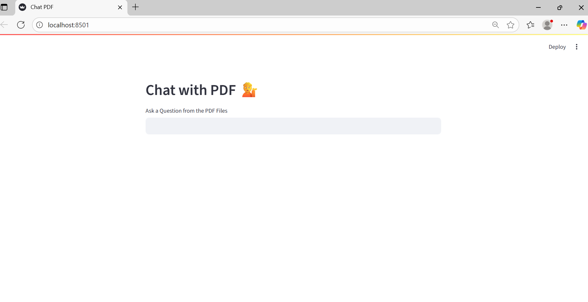

## 🧠 Intelligent Q&A Assistant (RAG + LLM Agents)

An end-to-end LLM-powered Question Answering system that uses Retrieval-Augmented Generation (RAG), LangChain Agents, and tool calling to answer domain-specific questions from large collections of documents.

---


## 🚀 Features

- 📄Document Ingestion & Preprocessing


  - Parses PDFs using PyPDFDirectoryLoader

  - Text chunking + embedding with RecursiveCharacterTextSplitter and Gemini Embedding 

  - Vector storage with AstraDB (serverless database)

- 🔍 Retrieval-Augmented Generation (RAG)

  - Contextual Q&A with top-k retrieval

- 🤖 Agentic Tool Use (LangChain Agents)

  - Query Rewriter tool when fail retrieve strong context

- 📝 Prompt Engineering 

    - Structured system prompts for safe output

    - Used Role-Playing, Guardrails, and Output Constraints to avoid hallucination

- 📊 Evaluation & Logging

  - Logs all responses, sources, and latency metrics with Langsmith

---

## Installation
To set up the Q&A Assistant locally, follow these steps:

1. Clone the repository to your local machine:
```python
   git clone https://github.com/samanta-sc/Question-Answering-System-with-Agentic-RAG.git
```
2. Navigate to the project directory:
```python
   cd Question-Answering-System-with-Agentic-RAG
```
3. Install the required Python packages using pip:
```python
pip install -r requirements.txt
```
4. Set up environment variables:
  - Define the necessary environment variables such as database connection strings, API keys, etc.
5. Run the Streamlit application:
```
streamlit run app.py
```

---

## 📸 Demo

<table>
  <tr>
    <td>Chat PDF API</td>
     <td>Answer from API</td>
  </tr>
  <tr>
    <td></td>
    <td></td>
  </tr>
 </table>
